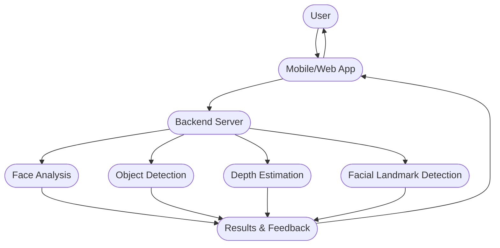
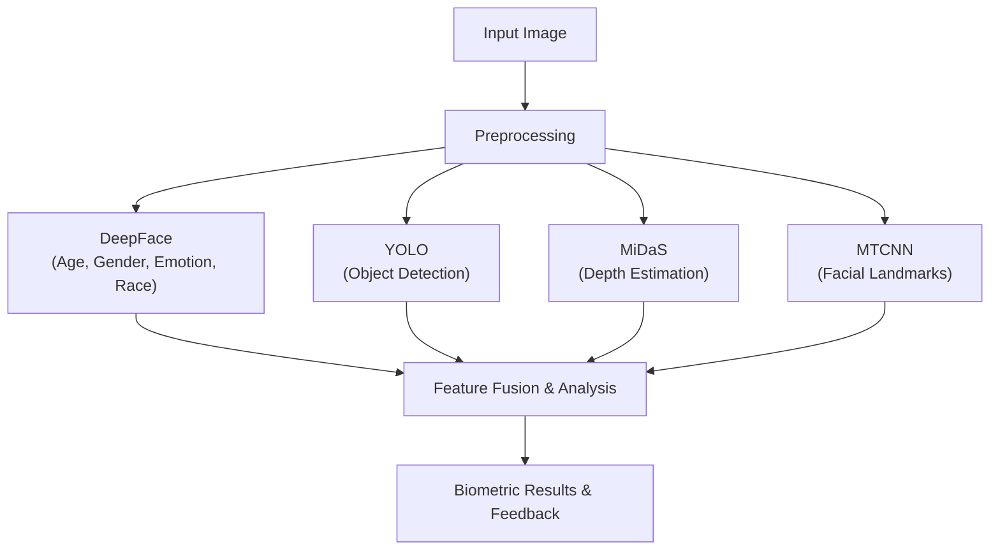
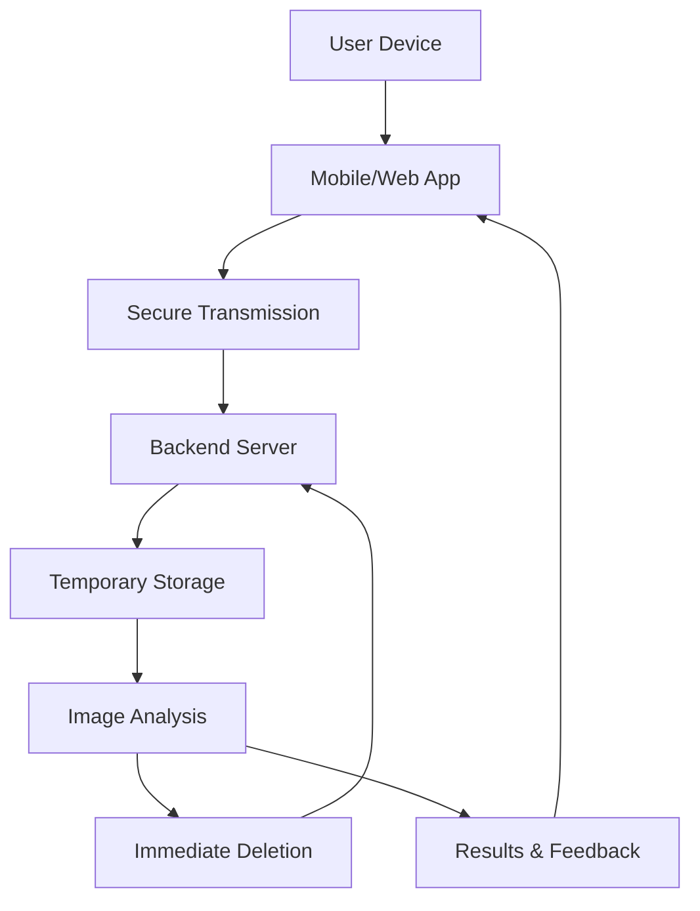
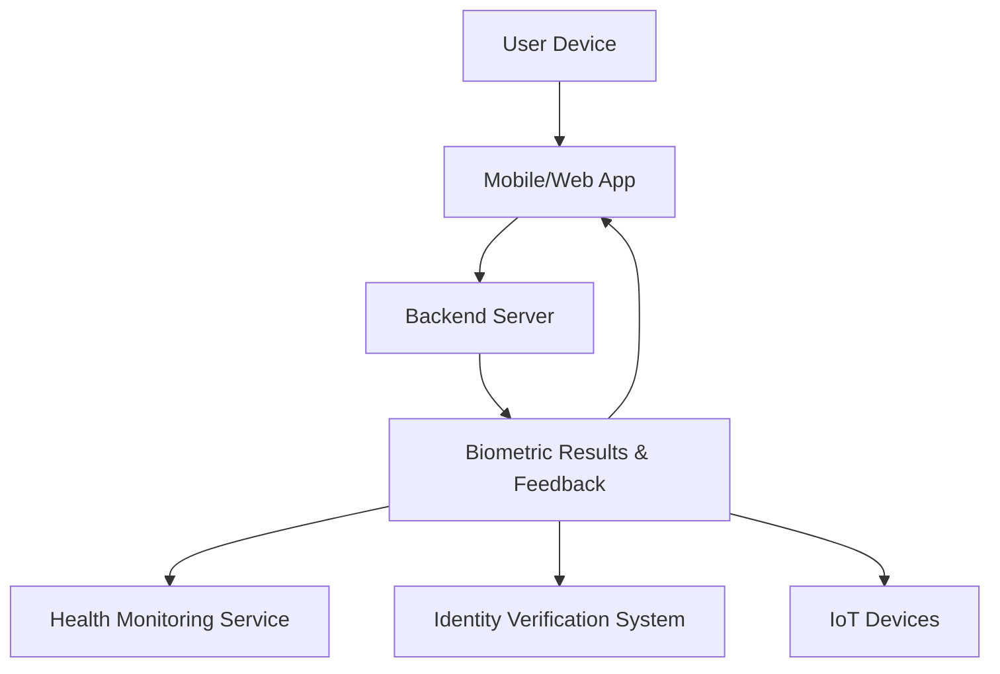
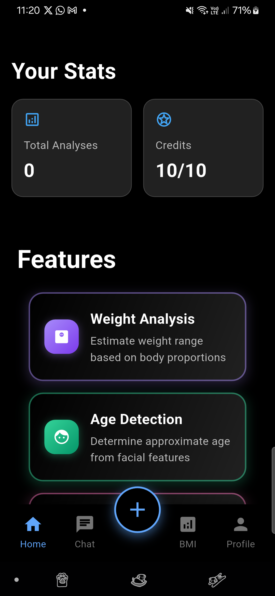
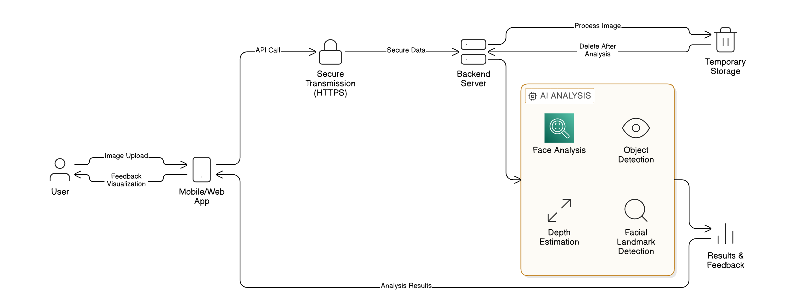
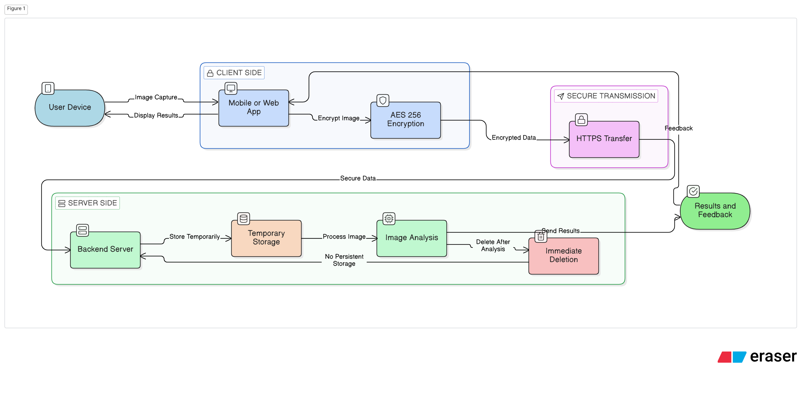

# Selfiemtrx

Selfiemtrx is a cross-platform biometric analysis platform that uses selfies and images to estimate and analyze user attributes such as height, weight range, age, gender, emotion, race, and object dimensions. The project combines a Flutter client, a Flask-based ML backend, and supporting web assets to provide a mobile-first experience with web deployment support.

## What It Does

- Upload or capture a selfie/image from mobile or web.
- Run face, object, and depth analysis through a unified ML pipeline.
- Estimate height using head-to-body ratio, depth cues, and reference objects.
- Return annotated results and feedback to the app.
- Process images temporarily and remove them after analysis for privacy.

## Repository Layout

- `App/` contains the Flutter application, mobile/web UI, Firebase integration, and platform-specific code.
- `ML/` contains the Flask API and Python ML models used for biometric analysis.
- `Website/` contains public site assets and branding resources.
- `Install/` contains a setup script for installing dependencies across the main components.
- `doc/` contains the project summary, formulas, patent notes, and design documentation.
- `pic/` contains diagrams, flowcharts, and sample output visuals.

## Core Capabilities

- Face analysis with age, gender, emotion, and race prediction.
- Object detection and object-based scaling for measurement workflows.
- Height estimation using depth estimation, landmark detection, and head-to-body ratio refinement.
- Real-time feedback through the app after image processing.
- Cross-platform delivery across Android, iOS, and web.

## Technology Stack

- Flutter / Dart for the client application.
- Flask, Pandas, NumPy, OpenCV, TensorFlow, PyTorch, and Python for the ML backend.
- DeepFace, YOLOv8, Detectron2, MiDaS, and MTCNN for biometric and vision analysis.
- Firebase, Google Sign-In, and shared preferences for user and app services.
- HTML, CSS, and JavaScript for web capture and presentation.

## Architecture

### System Overview



### ML Model Integration



### Privacy Workflow



### Application Integration



## Key Methods And Formulas

The technical documentation in `doc/` describes the main measurement methods used in Selfiemtrx:

- Head-to-body ratio correction for total height estimation.
- Depth and focal-length based height estimation.
- Reference object scaling when a known object is visible.
- Object bounding-box height calculation using detected coordinates.
- Face, object, and depth model fusion for a single analysis pass.

For the full derivations and explanations, see [doc/formulas_methods.md](doc/formulas_methods.md) and [doc/DESIGN_AND_DEVELOPMENT_OF_AN_INTELLIGENT_BIOMETRIC_ANALYSIS_SYSTEM.md](doc/DESIGN_AND_DEVELOPMENT_OF_AN_INTELLIGENT_BIOMETRIC_ANALYSIS_SYSTEM.md).

## Screenshots And Visuals

### Mobile App Screens

| Preview | Preview | Preview |
| --- | --- | --- |
|  |  |  |

### Project Visuals

| System Overview | Data Privacy | Sample Output |
| --- | --- | --- |
|  |  |  |

| Face Analysis | Object Info | External Services |
| --- | --- | --- |
|  |  |  |

Additional diagram sources are available in `pic/` as Mermaid flowcharts:

- `pic/fig1_system_architecture_improved.mmd`
- `pic/fig3_ml_model_integration_flow.mmd`
- `pic/fig4_data_privacy_workflow.mmd`
- `pic/fig7_application_integration.mmd`
- `pic/fig_sequence_biometric_analysis.mmd`

## Setup

### 1. Flutter App

```bash
cd App
flutter pub get
flutter run
```

### 2. ML Backend

```bash
cd ML
python3 -m venv venv
source venv/bin/activate
pip install -r requirements.txt
python main.py
```

### 3. Website Assets

```bash
cd Website
npm install
```

### 4. Full Install Script

You can also run the bundled installer from the project root:

```bash
chmod +x Install/install.sh
./Install/install.sh
```

## Documentation

- [Project summary](doc/project_summary.md)
- [Formulas and methods](doc/formulas_methods.md)
- [Design and development paper draft](doc/DESIGN_AND_DEVELOPMENT_OF_AN_INTELLIGENT_BIOMETRIC_ANALYSIS_SYSTEM.md)
- [Patent draft](doc/patent_draft.md)

## Notes

- The repository is structured for cross-platform biometric analysis and image processing.
- The `pic/` directory is the best place to add new figures or updated screenshots.
- If you add new UI captures, keep them in `App/` or a dedicated assets folder so they can be linked directly from this README.